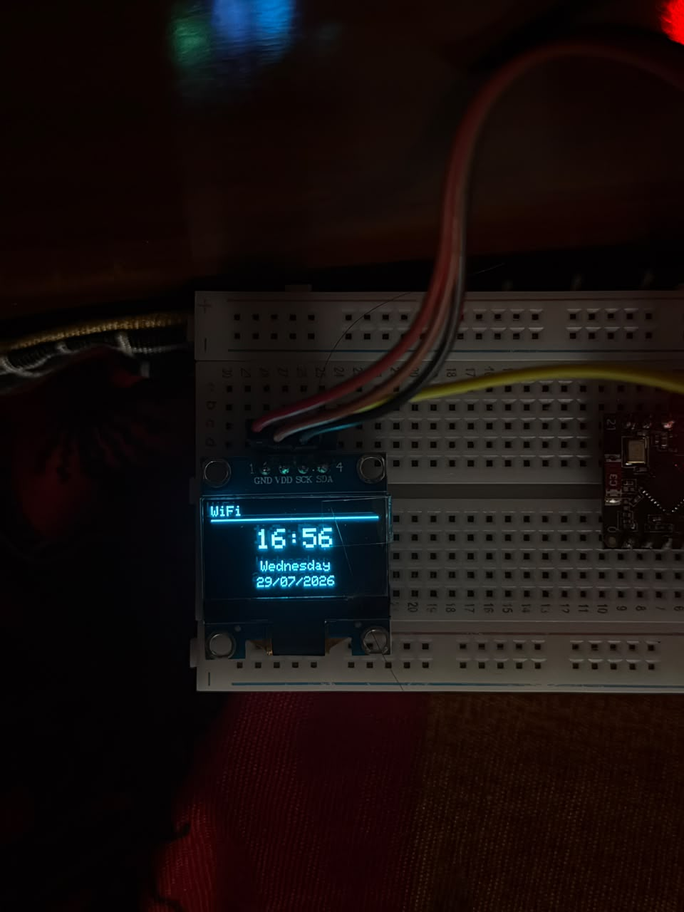
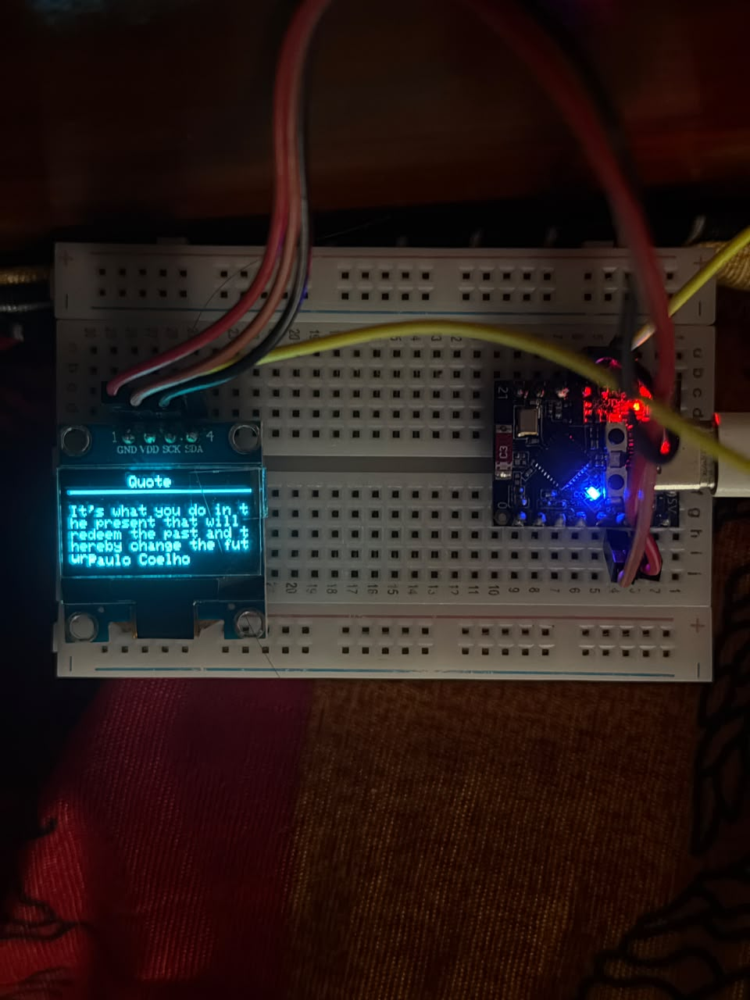
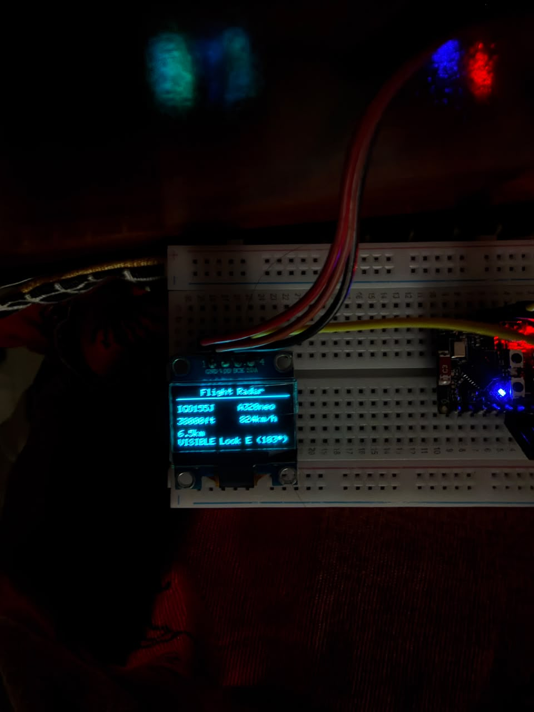
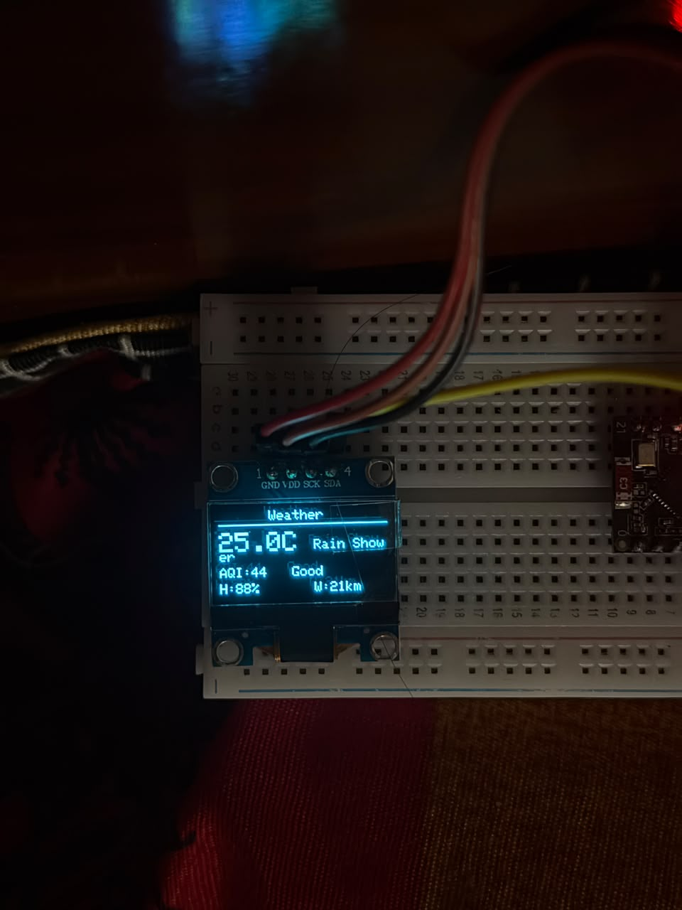

# Pocket Dashboard 📟

A compact smart dashboard built with the **ESP32-C3 SuperMini** and a **0.96" SSD1306 OLED Display**. It provides useful real-time information like time, weather, nearby aircraft, air quality, and motivational quotes in a clean, distraction-free interface.

---
## 📸 Preview

<p align="center">
  
  
  
  
</p>

## ✨ Features

### 🕒 Digital Clock
- Internet-synchronized time using NTP
- Current time, day, and date
- IST (GMT +5:30)

### 💬 Daily Quotes
- Random motivational quotes from ZenQuotes
- Auto-refresh every 5 minutes

### ✈️ Aircraft Radar
Powered by **ADSB.lol**

Displays the nearest flying aircraft:
- Callsign
- Aircraft Type
- Altitude (ft)
- Speed (km/h)
- Distance from your location
- Direction for nearby aircraft

Ground aircraft are automatically ignored, and nearby aircraft include a direction indicator to help with plane spotting.

### 🌤 Weather
Powered by **Open-Meteo**

Displays:
- Temperature
- Weather Condition
- Humidity
- Wind Speed

### 🌿 Air Quality
Powered by **Open-Meteo Air Quality**

Displays:
- AQI
- AQI Status

### 🔄 Auto Page Rotation

The dashboard automatically rotates through:

1. Clock
2. Quotes
3. Aircraft Radar
4. Weather & AQI

---

## 🛠 Hardware

- ESP32-C3 SuperMini
- 0.96" SSD1306 OLED Display (128×64)
- USB-C Power

---

## 📚 Libraries

- WiFi
- HTTPClient
- WiFiClientSecure
- ArduinoJson
- NTPClient
- WiFiUdp
- Adafruit GFX
- Adafruit SSD1306

---

## 🌐 APIs

| Service | Purpose |
|---------|---------|
| ADSB.lol | Nearby Aircraft |
| Open-Meteo | Weather |
| Open-Meteo Air Quality | AQI |
| ZenQuotes | Motivational Quotes |
| pool.ntp.org | Time Synchronization |

---

## 📂 Project Structure

```text
PocketDashboard/
│
├── pocketdashboard.ino
├── config.h
│
├── clock.cpp
├── quote.cpp
├── flight.cpp
├── weather.cpp
├── display.cpp
│
├── clock.h
├── quote.h
├── flight.h
├── weather.h
├── display.h
│
└── README.md
```

---

## ⚙️ Configuration

Update `config.h` with your Wi-Fi credentials and location.

```cpp
#define WIFI_SSID "YOUR_WIFI"
#define WIFI_PASSWORD "YOUR_PASSWORD"

const float MY_LAT = YOUR_LATITUDE;
const float MY_LON = YOUR_LONGITUDE;
```

No API keys are required.

---

## ⏱ Refresh Intervals

| Feature | Interval |
|---------|----------|
| Clock | Every second |
| Screen Rotation | Every 6 seconds |
| Quotes | Every 5 minutes |
| Aircraft Radar | Every minute |
| Weather | Every minute |
| AQI | Every minute |

All tasks use `millis()` for smooth, non-blocking execution.

---

## 📺 Screens

### 🕒 Clock

```text
21:30

Monday
20 Jul 2026
```

### 💬 Quote

```text
Stay hungry.
Stay foolish.

— Steve Jobs
```

### ✈️ Aircraft Radar

```text
IGO717

A321neo

11425ft 539km/h

8.4km

LOOK E (102°)
```

### 🌤 Weather

```text
29°C  Clear

AQI:42  Good

H:63%  W:11km/h
```

---

## 🚀 Roadmap

- Aircraft heading
- Better aircraft visibility detection
- Weather icons
- Wi-Fi signal strength
- Battery monitoring
- OTA firmware updates
- Bluetooth companion app

---

## 💡 About

Pocket Dashboard is a lightweight, modular information display built around the ESP32-C3. It combines useful real-time services into a simple interface while using non-blocking programming for smooth performance and easy future expansion.

---

## 📄 License

Released under the **MIT License** .
